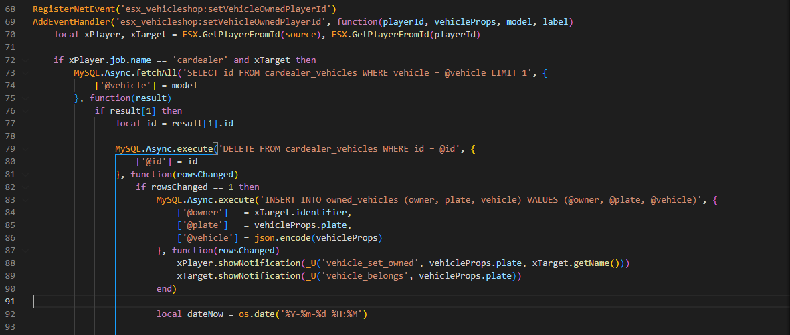
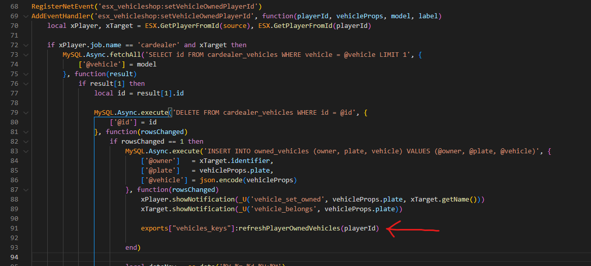
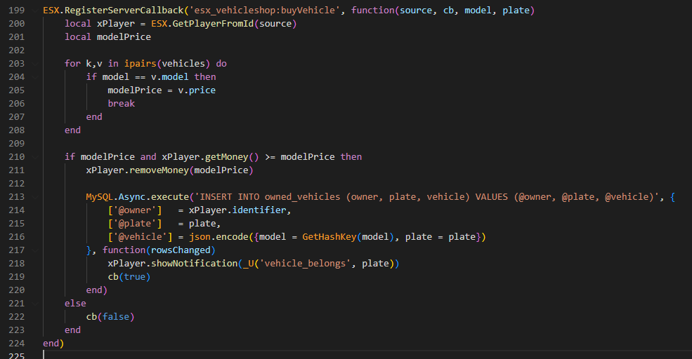
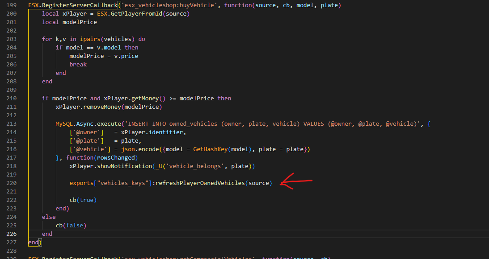
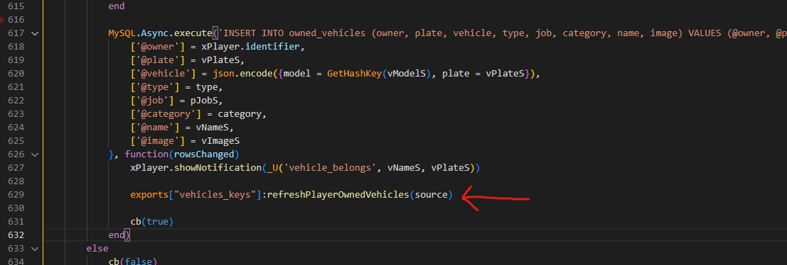
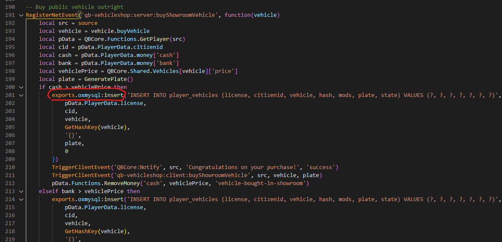
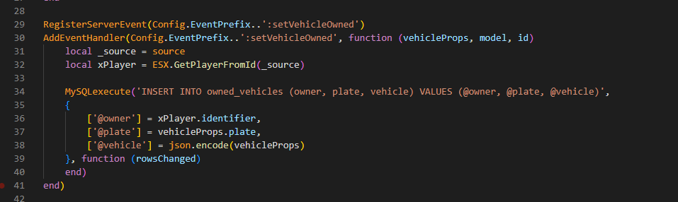

# Fix hotwiring bought car
If after you purchase a vehicle you have to hotwire it, you only have to add [this simple line of code](client/refreshMineOwnedVehicles.md) 

Otherwise, there are some common scripts solutions below:

## esx_vehicleshop

### First step

Go to `esx_vehicleshop/server/main.lua` and search for the following code:



And add this line 
```lua
exports["vehicles_keys"]:refreshPlayerOwnedVehicles(playerId)
```



### Second step

Go to `esx_vehicleshop/server/main.lua` (the same file as before) and search for the following code:



And add this line 
```lua
exports["vehicles_keys"]:refreshPlayerOwnedVehicles(source)
```



## esx_advancedvehicleshop
Go to `esx_advancedvehicleshop/server/main.lua` and search for the following code:


And add this line 
```lua
exports["vehicles_keys"]:refreshPlayerOwnedVehicles(source)
```




## qb-vehicleshop

### First step

Go to `qb-vehicleshop/server.lua` and you will have to add the following code after **all** `exports.oxmysql:insert` 

In the example, it will be shown only one time, but you have to add it multiple times



And add the following code

```lua
SetTimeout(1000, function() 
    exports["vehicles_keys"]:refreshPlayerOwnedVehicles( pData.PlayerData.source )
end)
```

In certain parts, you will have to replace `pData` with something else, here it will show where to add the code and on what `pData` depends


**Note**: the green circles showed in the screenshot must match, so if the first one is for example `targetPlayer`, the second one must be `targetPlayer` as well

### Second step

Go to `qb-vehicleshop/server.lua` (the same file as before) and replace all these events (they are at the bottom of the file)
```lua
TriggerClientEvent('vehiclekeys:client:SetOwner', buyerId, plate)
``` 

with the following code

```lua
SetTimeout(1000, function() 
    exports["vehicles_keys"]:refreshPlayerOwnedVehicles(buyerId)
end)
```


## okokVehicleShop

Go to `okokVehicleShop/sv_utils.lua` and search for the following code:



And add this line 
```lua
exports["vehicles_keys"]:refreshPlayerOwnedVehicles(_source)
```

