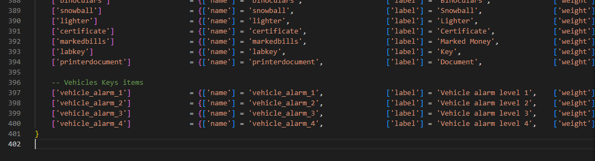

# QB-Core installation tutorial
The installation for **QB-Core** it's a bit longer than the **ESX** one where it's almost all automated

## Adding the items
To add the new items, you have to edit `qb-core/shared/items.lua` file and add at the bottom of the table the following code

```lua
	-- Vehicles Keys items
	['vehicle_alarm_1'] 			 = {['name'] = 'vehicle_alarm_1', 				['label'] = 'Vehicle alarm level 1',	['weight'] = 500, 		['type'] = 'item', 		['image'] = 'your_image.png',		['unique'] = false,		['useable'] = true, 	['shouldClose'] = true,	   ['combinable'] = nil,   ['description'] = 'Vehicle alarm level 1'},
	['vehicle_alarm_2'] 			 = {['name'] = 'vehicle_alarm_2', 				['label'] = 'Vehicle alarm level 2',	['weight'] = 500, 		['type'] = 'item', 		['image'] = 'your_image.png', 		['unique'] = false,		['useable'] = true, 	['shouldClose'] = true,	   ['combinable'] = nil,   ['description'] = 'Vehicle alarm level 2'},
	['vehicle_alarm_3'] 			 = {['name'] = 'vehicle_alarm_3', 				['label'] = 'Vehicle alarm level 3',	['weight'] = 500, 		['type'] = 'item', 		['image'] = 'your_image.png', 		['unique'] = false,		['useable'] = true, 	['shouldClose'] = true,	   ['combinable'] = nil,   ['description'] = 'Vehicle alarm level 3'},
	['vehicle_alarm_4'] 			 = {['name'] = 'vehicle_alarm_4', 				['label'] = 'Vehicle alarm level 4',	['weight'] = 500, 		['type'] = 'item', 		['image'] = 'your_image.png', 		['unique'] = false,		['useable'] = true, 	['shouldClose'] = true,	   ['combinable'] = nil,   ['description'] = 'Vehicle alarm level 4'},
```

### Screenshot example:


## Installing ESX menu
To make the script works, you need to install ESX menu

This esx_menu_default script is edited by the creator of QB-Core framework, you can find it in QBCore Discord server in conversion channel, or directly from this [link](https://cdn.discordapp.com/attachments/837369580921552936/915519378852810762/esx_menu_default.rar)

<!-- Be sure to add it in server.cfg auto start -->